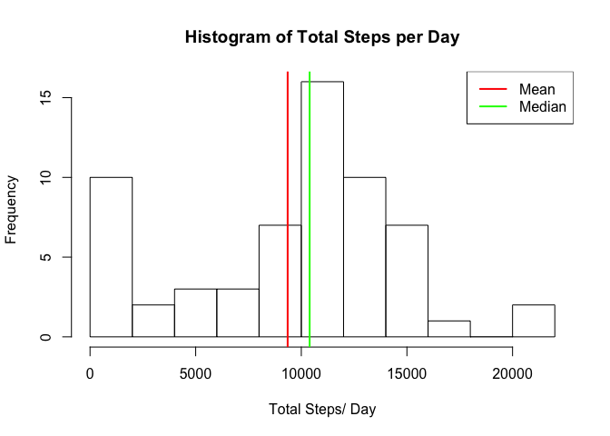
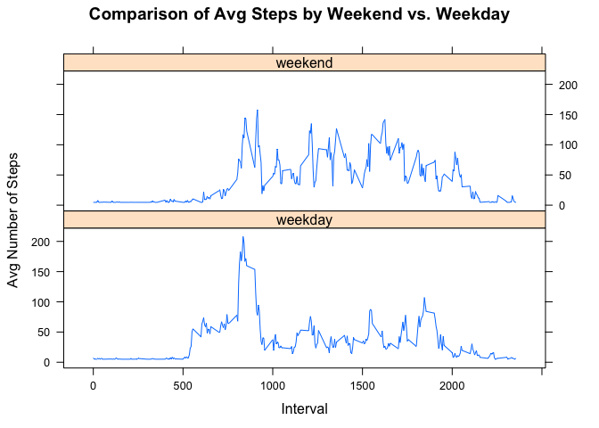

# Reproducible Research: Peer Assessment 1


## Loading and preprocessing the data
*Load Required Packages*

```r
if (!require("lattice")) {install.packages("lattice")}
```

```
## Loading required package: lattice
```

```r
require(ggplot2)
```

```
## Loading required package: ggplot2
```

```r
if (!require("plyr")) {install.packages("plyr")}
```

```
## Loading required package: plyr
```

```r
require(plyr)

if (!require("knitr")) {install.packages("knitr")}
```

```
## Loading required package: knitr
```

```r
require(knitr)
```
*Download data if necessary*

```r
if (!file.exists("./activity_data.zip")) {
        fileURL<-"https://d396qusza40orc.cloudfront.net/repdata%2Fdata%2Factivity.zip"
        download.file(fileURL, "./activity_data.zip", method = "curl")
        unzip("./activity_data.zip", overwrite = T)
        dateDownloaded <- date()
        dateDownloaded
}
```

```
## [1] "Sat Oct 18 16:17:24 2014"
```
*Read and Transform Data*  
Data is read and the structure of the data frame is displayed.

```r
activity<-read.csv("activity.csv", colClasses=c("integer","Date","integer"))
str(activity)
```

```
## 'data.frame':	17568 obs. of  3 variables:
##  $ steps   : int  NA NA NA NA NA NA NA NA NA NA ...
##  $ date    : Date, format: "2012-10-01" "2012-10-01" ...
##  $ interval: int  0 5 10 15 20 25 30 35 40 45 ...
```
A summary of the data is also provided.  As we can see, there are many null values in the steps data.

```r
summary(activity)
```

```
##      steps            date               interval   
##  Min.   :  0.0   Min.   :2012-10-01   Min.   :   0  
##  1st Qu.:  0.0   1st Qu.:2012-10-16   1st Qu.: 589  
##  Median :  0.0   Median :2012-10-31   Median :1178  
##  Mean   : 37.4   Mean   :2012-10-31   Mean   :1178  
##  3rd Qu.: 12.0   3rd Qu.:2012-11-15   3rd Qu.:1766  
##  Max.   :806.0   Max.   :2012-11-30   Max.   :2355  
##  NA's   :2304
```
## What is mean total number of steps taken per day?

```r
totalSteps<-tapply(activity$steps,activity$date,sum,na.rm=T)
stepsMean<-mean(totalSteps)
stepsMean
```

```
## [1] 9354
```

```r
stepsMedian<-median(totalSteps)
stepsMedian
```

```
## [1] 10395
```
*Histogram of Total Steps/ Day*

```r
hist(totalSteps, breaks=10, main="Histogram of Total Steps per Day",xlab="Total Steps/ Day")
abline(v=stepsMean,col="Red", lwd=2)
abline(v=stepsMedian,col="Green", lwd=2)
legend(x="topright", legend=c("Mean","Median"), col=c("Red","Green"),lwd=2)
```

 


## What is the average daily activity pattern?
*Calculate the average across all days and plot*  
  - Make a time series plot (i.e. type = “l”) of the 5-minute interval (x-axis) and the average number of steps taken, averaged across all days (y-axis)

```r
avgSteps <- aggregate(steps ~ interval, data = activity, mean, na.rm = TRUE)
plot(steps ~ interval, data = avgSteps, main="Avg Steps per Day", ylab="Avg Steps", type = "l")
```

 
  
  - Which 5-minute interval, on average across all the days in the dataset, contains the maximum number of steps?  
  *The interval with the maximum number of average steps is calculated below*

```r
maxInterval<-avgSteps[which.max(avgSteps$steps), ]$interval
maxInterval
```

```
## [1] 835
```

## Imputing missing values  
  - Calculate and report the total number of missing values in the dataset (i.e. the total number of rows with NAs)

```r
sum(is.na(activity))
```

```
## [1] 2304
```
  - Devise a strategy for filling in all of the missing values in the dataset. The strategy does not need to be sophisticated. For example, you could use the mean/median for that day, or the mean for that 5-minute interval, etc.  
  
*The mean can be used to approximate the missing values.  A summary is provided to demonstrate that the null values have been removed.*

```r
activity_nonull <- activity
activity_nonull$steps[is.na(activity_nonull$steps)] <- mean(activity_nonull$steps, na.rm = T)
summary(activity_nonull)
```

```
##      steps            date               interval   
##  Min.   :  0.0   Min.   :2012-10-01   Min.   :   0  
##  1st Qu.:  0.0   1st Qu.:2012-10-16   1st Qu.: 589  
##  Median :  0.0   Median :2012-10-31   Median :1178  
##  Mean   : 37.4   Mean   :2012-10-31   Mean   :1178  
##  3rd Qu.: 37.4   3rd Qu.:2012-11-15   3rd Qu.:1766  
##  Max.   :806.0   Max.   :2012-11-30   Max.   :2355
```
  - Make a histogram of the total number of steps taken each day and Calculate and report the mean and median total number of steps taken per day. 


```r
totalSteps_nonull<-tapply(activity_nonull$steps,activity_nonull$date,sum,na.rm=T)
stepsMean_nonull<-mean(totalSteps_nonull)
stepsMean_nonull
```

```
## [1] 10766
```

```r
stepsMedian_nonull<-median(totalSteps_nonull)
stepsMedian_nonull
```

```
## [1] 10766
```
*A side-by-side plot of the two datasets is provided for comparison.*

```r
par(mar=c(2,2,2,2),mfcol=c(1,2))
hist(totalSteps, breaks=10, main="TTL Steps/Day with null values",xlab="Total Steps/ Day")
abline(v=stepsMean,col="Red", lwd=2)
abline(v=stepsMedian,col="Green", lwd=2)
hist(totalSteps_nonull, breaks=10, main="TTL Steps/Day without null values",xlab="Total Steps/ Day")
abline(v=stepsMean_nonull,col="Red", lwd=2)
abline(v=stepsMedian_nonull,col="Green", lwd=2)
```

 
  
  - Do these values differ from the estimates from the first part of the assignment?  
        *Yes. The average steps per day vary in each interval that originally had null values.*  
  - What is the impact of imputing missing data on the estimates of the total daily number of steps?  
        *The results of the analysis will change based on the method used to impute the missing data*  

## Are there differences in activity patterns between weekdays and weekends?  
  - For this part the weekdays() function may be of some help here. Use the dataset with the filled-in missing values for this part.  
  
  - Create a new factor variable in the dataset with two levels – “weekday” and “weekend” indicating whether a given date is a weekday or weekend day.
  

```r
activity_nonull$dayCat<-factor(weekdays(activity_nonull$date) %in% c("Saturday","Sunday"),
                               labels=c("weekday","weekend"), ordered=FALSE)
summary(activity_nonull)
```

```
##      steps            date               interval        dayCat     
##  Min.   :  0.0   Min.   :2012-10-01   Min.   :   0   weekday:12960  
##  1st Qu.:  0.0   1st Qu.:2012-10-16   1st Qu.: 589   weekend: 4608  
##  Median :  0.0   Median :2012-10-31   Median :1178                  
##  Mean   : 37.4   Mean   :2012-10-31   Mean   :1178                  
##  3rd Qu.: 37.4   3rd Qu.:2012-11-15   3rd Qu.:1766                  
##  Max.   :806.0   Max.   :2012-11-30   Max.   :2355
```
  
  - Make a panel plot containing a time series plot (i.e. type = “l”) of the 5-minute interval (x-axis) and the average number of steps taken, averaged across all weekday days or weekend days (y-axis). 

```r
avgSteps_nonull <- aggregate(steps ~ interval + dayCat, data = activity_nonull, mean)
xyplot(steps ~ interval | dayCat, avgSteps_nonull, type = "l", layout = c(1, 2), 
       xlab = "Interval", ylab = "Avg Number of Steps", 
       main="Comparison of Avg Steps by Weekend vs. Weekday")
```

 
  
*The charts demonstrate that activity continues at a higher rate thoughout the day on Weekends*
